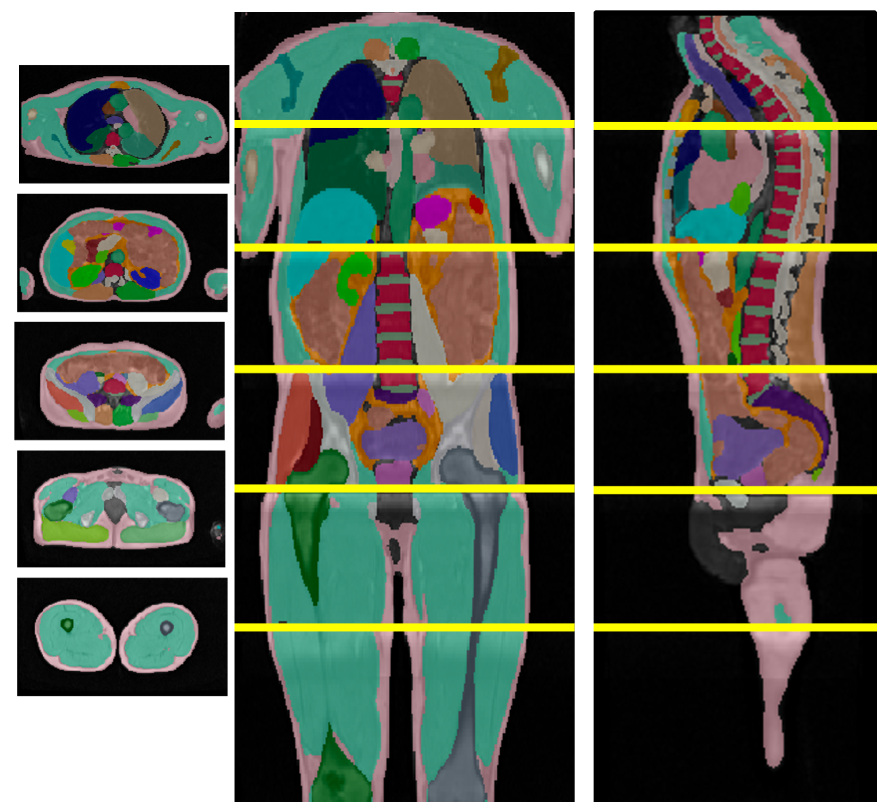
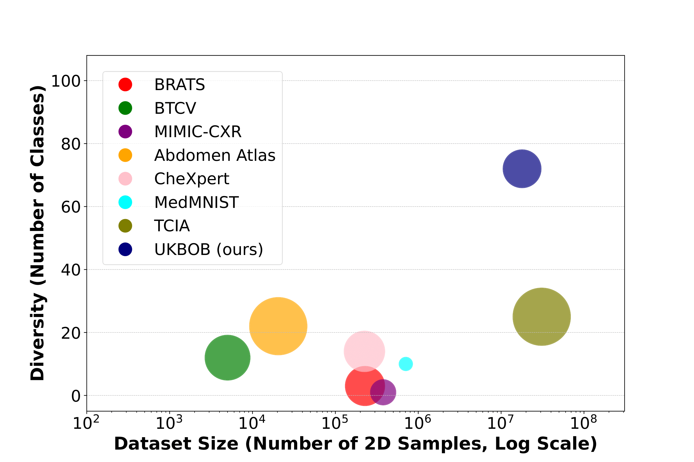

<h1 align="center">UKBOB: One Billion MRI Masks for Generalizable 3D Medical Image Segmentation</h1>

<div align="center">
  <a href="https://emmanuelleb985.github.io/ukbob/">Project page</a> &nbsp;|&nbsp;
  <a href="https://arxiv.org/abs/2504.06908">Arxiv</a> &nbsp;|&nbsp;
  <a href="https://youtu.be/pxhqze2Gv5U">Youtube</a>
</div>
<br>

<div align="center">
     

</div>

UKBOB is a large-scale 3D MRI dataset with 51,761 samples, over 1.37 billion segmentation masks, and 72 organs, created using automated labeling and refined through a novel cleaning pipeline validated by manual annotations. Our foundation model, Swin-BOB, based on Swin-UNetr trained on UKBOB, achieves state-of-the-art performance on benchmarks including BRATS and BTCV.


## BibTeX
```bibtex
@misc{bourigault2025ukbobbillionmrilabeled,
      title={UKBOB: One Billion MRI Labeled Masks for Generalizable 3D Medical Image Segmentation}, 
      author={Emmanuelle Bourigault and Amir Jamaludin and Abdullah Hamdi},
      year={2025},
      eprint={2504.06908},
      archivePrefix={arXiv},
      primaryClass={cs.CV},
      url={https://arxiv.org/abs/2504.06908}, 
}
```


## Installing Dependencies
Create the conda environment and activate it.
```
conda env create -f environment.yml
conda activate swin_bob
```

## Datasets and Preprocessing 

For out-of-domain evaluation, we use the **BTCV** and **BRATS23** datasets where we preserve the train-val-test splits. 
Please download these public datasets and associated json files for [BRATS](https://www.synapse.org/Synapse:syn51156910/wiki/627000) and [BTCV](https://www.synapse.org/Synapse:syn3193805/wiki/217789).


## Pre-trained Models

We will provide pre-trained weights for Swin-UNETR backbone trained on more than 50k 3D MRI with filtered labels from the UK Biobank. 
In the meantime, we provide weights for our segmentation model with ETTA on **BTCV** [here](https://drive.google.com/file/d/1mTuJ80UknqP-y3E3n5mcXUWj5Imx3Q2r/view?usp=sharing) and **BRATS** [here](https://drive.google.com/file/d/1CRhw61DgKRD22TFuT4Aqu_Urq2F1Zdmh/view?usp=sharing).
Please download the weights and follow the instructions below to run inference and visualise the outputs.

## Inference

To evaluate `Swin-BoB` with ETTA on **BTCV**:

```bash
cd BTCV

```

```bash
python test_etta.py --json_list='./data/BTCV/dataset_0.json' --data_dir='./data/BTCV/' --feature_size=48 --infer_overlap=0.5 --pretrained_model_name=model_final.pt  --generate_gifs --gif_frames 120 --gif_downsample 2  --gif_duration 0.7

```


## Training

To train on UKBOB, you need to have access to the data from [here](https://community.ukbiobank.ac.uk/hc/en-gb). We use the initial segmentation labels from [2] that we filter with our custom _Specialized Organ Label Filter (SOLF)_.

```bash
python UKBOB/filtering/organ_filtering.py
```

To train a `Swin-BoB` with a single gpu:

```bash
cd UKBOB
```

```bash
python main.py --json_list='./dataset.json' --data_dir='./UKBOB/' --val_every=5 --use_checkpoint --roi_x=96 --roi_y=96 --roi_z=96 --in_channels=4 --spatial_dims=3 --feature_size=48 --save_checkpoint --batch_size=1

```

For multi-gpu training, run the following: 

```bash
cd UKBOB
```

```bash
python main.py --json_list='./dataset.json' --data_dir='./UKBOB/' --val_every=5 --use_checkpoint --roi_x=96 --roi_y=96 --roi_z=96 --in_channels=4 --spatial_dims=3 --feature_size=48 --save_checkpoint --batch_size=1 --distributed 

```

# License
MIT License.


## Citations
This work is based on Swin-UNetr, TotalVibeSegmentator, InTEnt and MONAI. We thank the authors of these works, please consider citing them:

```

@article{hatamizadeh2022swin,
  title={Swin UNETR: Swin Transformers for Semantic Segmentation of Brain Tumors in MRI Images},
  author={Hatamizadeh, Ali and Nath, Vishwesh and Tang, Yucheng and Yang, Dong and Roth, Holger and Xu, Daguang},
  journal={arXiv preprint arXiv:2201.01266},
  year={2022}
}

@article{graf2024totalvibesegmentator,
  title={TotalVibeSegmentator:  Full Body MRI Segmentation for the NAKO and UK Biobank },
  author={Graf, Robert and Platzek, Paul-S{\"o}ren and Riedel, Evamaria Olga and Ramsch{\"u}tz, Constanze and Starck, Sophie and M{\"o}ller, Hendrik Kristian and Atad, Matan and V{\"o}lzke, Henry and B{\"u}low, Robin and Schmidt, Carsten Oliver and others},
  journal={arXiv preprint arXiv:2406.00125},
  year={2024}
}

@inproceedings{Dong2024MedicalIS,
  title={Medical Image Segmentation with InTEnt: Integrated Entropy Weighting for Single Image Test-Time Adaptation},
  author={Haoyu Dong and N. Konz and Han Gu and Maciej A. Mazurowski},
  year={2024},
  url={https://api.semanticscholar.org/CorpusID:267682146}
}

@misc{cardoso2022monaiopensourceframeworkdeep,
      title={MONAI: An open-source framework for deep learning in healthcare}, 
      author={M. Jorge Cardoso and Wenqi Li and Richard Brown and Nic Ma and Eric Kerfoot and Yiheng Wang and Benjamin Murrey and Andriy Myronenko and Can Zhao and Dong Yang and Vishwesh Nath and Yufan He and Ziyue Xu and Ali Hatamizadeh and Andriy Myronenko and Wentao Zhu and Yun Liu and Mingxin Zheng and Yucheng Tang and Isaac Yang and Michael Zephyr and Behrooz Hashemian and Sachidanand Alle and Mohammad Zalbagi Darestani and Charlie Budd and Marc Modat and Tom Vercauteren and Guotai Wang and Yiwen Li and Yipeng Hu and Yunguan Fu and Benjamin Gorman and Hans Johnson and Brad Genereaux and Barbaros S. Erdal and Vikash Gupta and Andres Diaz-Pinto and Andre Dourson and Lena Maier-Hein and Paul F. Jaeger and Michael Baumgartner and Jayashree Kalpathy-Cramer and Mona Flores and Justin Kirby and Lee A. D. Cooper and Holger R. Roth and Daguang Xu and David Bericat and Ralf Floca and S. Kevin Zhou and Haris Shuaib and Keyvan Farahani and Klaus H. Maier-Hein and Stephen Aylward and Prerna Dogra and Sebastien Ourselin and Andrew Feng},
      year={2022},
      eprint={2211.02701},
      archivePrefix={arXiv},
      primaryClass={cs.LG},
      url={https://arxiv.org/abs/2211.02701}, 
}
```

## References

[1]: Hatamizadeh, A., Nath, V., Tang, Y., Yang, D., Roth, H. and Xu, D., (2022). Swin UNETR: Swin Transformers for Semantic Segmentation of Brain Tumors in MRI Images. arXiv preprint arXiv:2201.01266.

[2]: Graf, R., Platzek, P., Riedel, E.O., Ramschutz, C., Starck, S., Moller, H.K., Atad, M., Vőlzke, H., Bulow, R., Schmidt, C.O., Rudebusch, J., Jung, M., Reisert, M., Weiss, J., Loffler, M., Bamberg, F., Wiestler, B., Paetzold, J.C., Rueckert, D., & Kirschke, J.S. (2024). TotalVibeSegmentator: Full Body MRI Segmentation for the NAKO and UK Biobank.

[3]: Dong, H., Konz, N., Gu, H., & Mazurowski, M.A. (2024). Medical Image Segmentation with InTEnt: Integrated Entropy Weighting for Single Image Test-Time Adaptation. 2024 IEEE/CVF Conference on Computer Vision and Pattern Recognition Workshops (CVPRW), 5046-5055.

[4] Cardoso, M.J., Li, W., Brown, R., Ma, N., Kerfoot, E., Wang, Y., Murrey, B., Myronenko, A., Zhao, C., Yang, D., Nath, V., He, Y., Xu, Z., Hatamizadeh, A., Zhu, W., Liu, Y., Zheng, M., Tang, Y., Yang, I., Zephyr, M., Hashemian, B., Alle, S., Darestani, M.Z., Budd, C., Modat, M., Vercauteren, T.K., Wang, G., Li, Y., Hu, Y., Fu, Y., Gorman, B.L., Johnson, H.J., Genereaux, B.W., Erdal, B.S., Gupta, V., Diaz-Pinto, A., Dourson, A., Maier-Hein, L., Jaeger, P.F., Baumgartner, M., Kalpathy-Cramer, J., Flores, M.G., Kirby, J.S., Cooper, L.A., Roth, H.R., Xu, D., Bericat, D., Floca, R.O., Zhou, S.K., Shuaib, H., Farahani, K., Maier-Hein, K.H., Aylward, S., Dogra, P., Ourselin, S., & Feng, A. (2022). MONAI: An open-source framework for deep learning in healthcare. ArXiv, abs/2211.02701.
