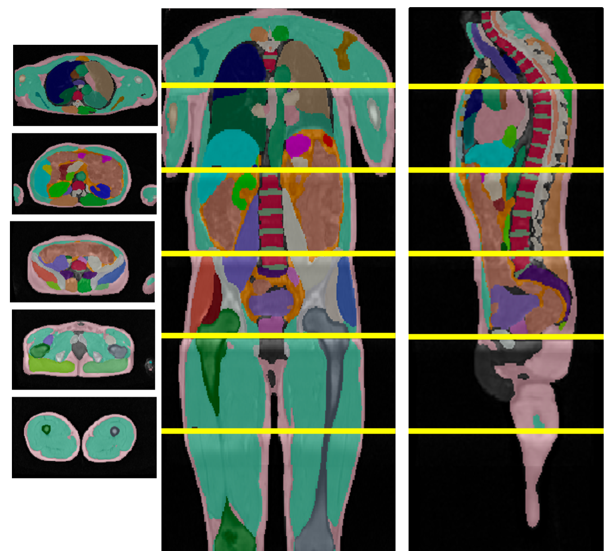
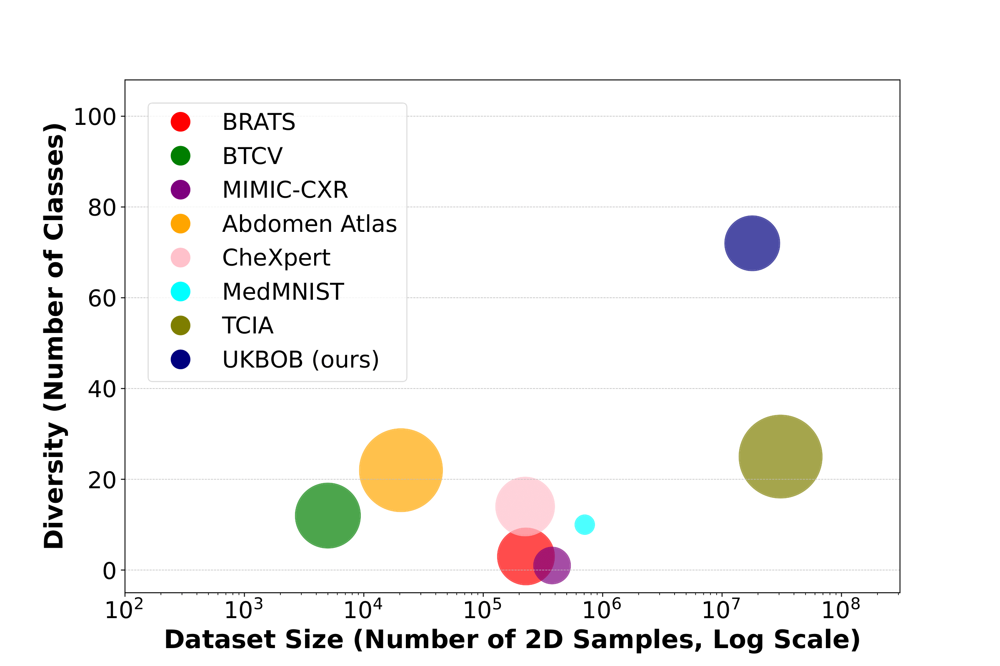

# UKBOB: One Billion MRI Masks for Generalizable 3D Medical Image Segmentation [ICCV2025]

[](https://opensource.org/licenses/MIT)
[](https://www.python.org/downloads/)
[](https://pytorch.org/)
[](https://monai.io/)

<div align="center">
     
</div>

## Project Overview

UKBOB represents a breakthrough in medical image segmentation, introducing the largest-scale 3D MRI dataset to date with **51,761 samples**, over **1.37 billion segmentation masks**, and **72 anatomical structures**. Our foundation model, **Swin-BOB**, achieves state-of-the-art performance on multiple medical imaging benchmarks.

### Key Innovations

- **Massive Scale**: 51,761 3D MRI scans with comprehensive multi-organ annotations
- **Foundation Model**: Swin-UNetr based architecture optimized for 3D medical imaging
- **Advanced Pipeline**: Novel Specialized Organ Label Filter (SOLF) for automated quality control
- **SOTA Performance**: Superior results on BRATS and BTCV benchmarks
- **Efficient Training**: Distributed training support with gradient checkpointing

## Performance Metrics

| Dataset | Dice Score | HD95 | Organs | Previous SOTA |
|---------|------------|------|---------|---------------|
| BTCV    | 85.3%     | 4.2mm | 13      | 83.1%        |
| BRATS23 | 91.2%     | 3.8mm | 3       | 89.7%        |

## Architecture

### Model Design

Our Swin-BOB architecture leverages the power of Swin Transformers for 3D medical image segmentation:

```
Input (96×96×96) → Swin-UNetr Encoder → Bottleneck → Decoder → Output (72 channels)
```

#### Key Components:

1. **Hierarchical Vision Transformer**: Shifted window attention mechanism for efficient 3D processing
2. **Skip Connections**: U-Net style architecture preserving spatial information
3. **Deep Supervision**: Multi-scale loss computation for improved gradient flow
4. **ETTA Module**: Entropy-based Test-Time Adaptation for robust inference

### Technical Specifications

- **Input Resolution**: 96×96×96 voxels
- **Feature Dimensions**: 48 (base), scaled to 768 (bottleneck)
- **Attention Heads**: 3, 6, 12, 24 (hierarchical)
- **Window Size**: 7×7×7 with shift of 3
- **Parameters**: ~62M trainable parameters

## Installation

### Prerequisites

- Python 3.8+
- CUDA 11.8+
- 32GB+ GPU memory (for training)
- 128GB+ RAM (for data preprocessing)

### Environment Setup

```bash
# Clone the repository
git clone https://github.com/EmmanuelleB985/UK_BOB.git
cd UKBOB

# Create conda environment
conda env create -f environment.yml
conda activate swin_bob
```

## Data Preparation

### Dataset Structure

```
data/
├── UKBOB/
│   ├── images/
│   │   ├── subject_001_T1.nii.gz
│   │   ├── subject_001_T2.nii.gz
│   │   └── ...
│   ├── labels/
│   │   ├── subject_001_label.nii.gz
│   │   └── ...
│   └── dataset.json
├── BTCV/
│   └── ...
└── BRATS23/
    └── ...
```

### Preprocessing Pipeline

1. **Resampling**: Standardize voxel spacing to 1.5×1.5×2.0 mm³
2. **Intensity Normalization**: Window/level adjustment and z-score normalization
3. **Cropping**: Remove background and center ROI extraction
4. **Augmentation**: Random flips, rotations, intensity shifts

```python
# Example preprocessing configuration
transform = Compose([
    LoadImaged(keys=["image", "label"]),
    EnsureChannelFirstd(keys=["image", "label"]),
    Spacingd(keys=["image", "label"], pixdim=(1.5, 1.5, 2.0)),
    ScaleIntensityRanged(keys=["image"], a_min=-175, a_max=250, b_min=0, b_max=1),
    CropForegroundd(keys=["image", "label"], source_key="image"),
    RandCropByPosNegLabeld(keys=["image", "label"], label_key="label", 
                          spatial_size=(96, 96, 96), num_samples=4)
])
```

## Training

### Single-GPU Training

```bash
cd UKBOB
python main.py \
    --json_list='./dataset.json' \
    --data_dir='./data/UKBOB/' \
    --feature_size=48 \
    --batch_size=2 \
    --optim_lr=1e-4 \
    --max_epochs=500 \
    --val_every=10 \
    --save_checkpoint
```

### Multi-GPU Distributed Training

```bash
# Launch on 8 GPUs using PyTorch Distributed
python main.py \
    --json_list='./dataset.json' \
    --data_dir='./data/UKBOB/' \
    --distributed \
    --world_size=8 \
    --batch_size=1 \
    --use_checkpoint  # Enable gradient checkpointing for memory efficiency
```

### Advanced Training Options

```bash
# Full configuration example
python main.py \
    --json_list='./dataset.json' \
    --data_dir='./data/UKBOB/' \
    --feature_size=48 \
    --batch_size=2 \
    --optim_name='adamw' \
    --optim_lr=1e-4 \
    --reg_weight=1e-5 \
    --lrschedule='warmup_cosine' \
    --warmup_epochs=50 \
    --max_epochs=1000 \
    --val_every=20 \
    --roi_x=96 --roi_y=96 --roi_z=96 \
    --in_channels=4 \
    --out_channels=72 \
    --dropout_path_rate=0.1 \
    --RandFlipd_prob=0.5 \
    --RandRotate90d_prob=0.5 \
    --use_checkpoint \
    --save_checkpoint \
    --distributed
```

### Training Monitoring

Monitor training progress using TensorBoard:

```bash
tensorboard --logdir=./runs --port=6006
```

Tracked metrics include:
- Training/validation loss
- Dice scores per organ
- Learning rate schedule
- GPU memory usage
- Gradient norms

## Inference

### Basic Inference

```python
from inference import SwinBOBInference

# Initialize model
model = SwinBOBInference(
    checkpoint_path='./pretrained_models/swin_bob_best.pt',
    device='cuda'
)

# Run inference
prediction = model.predict(
    image_path='./test_scan.nii.gz',
    sliding_window=True,
    overlap=0.5
)
```

### ETTA-Enhanced Inference

```bash
cd BTCV
python test_etta.py \
    --json_list='./data/BTCV/dataset_0.json' \
    --data_dir='./data/BTCV/' \
    --pretrained_model_name='model_final.pt' \
    --feature_size=48 \
    --infer_overlap=0.5 \
    --generate_gifs \
    --save_predictions
```

## Advanced Features

### Specialized Organ Label Filter (SOLF)

Our novel filtering pipeline ensures high-quality training data:

```python
python UKBOB/filtering/organ_filtering.py \
    --input_dir='./raw_labels/' \
    --output_dir='./filtered_labels/' \
    --confidence_threshold=0.8
```

### Memory-Efficient Training

Enable gradient checkpointing for large batch sizes:

```python
model = SwinUNETR(
    img_size=(96, 96, 96),
    in_channels=4,
    out_channels=72,
    feature_size=48,
    use_checkpoint=True  # Enable gradient checkpointing
)
```

### Custom Loss Functions

Implement organ-specific weighting:

```python
class WeightedDiceCELoss(nn.Module):
    def __init__(self, organ_weights):
        self.dice_loss = DiceCELoss(to_onehot_y=True, softmax=True)
        self.weights = organ_weights
        
    def forward(self, pred, target):
        loss = self.dice_loss(pred, target)
        weighted_loss = loss * self.weights
        return weighted_loss.mean()
```

## Evaluation Metrics

### Comprehensive Evaluation Suite

- **Dice Score**: Volumetric overlap measurement
- **Hausdorff Distance (HD95)**: Surface distance metric
- **Average Symmetric Surface Distance (ASSD)**: Mean surface deviation
- **Sensitivity & Specificity**: Detection performance
- **Volume Correlation**: Size estimation accuracy

### Generate Evaluation Reports

```bash
python evaluate.py \
    --prediction_dir='./predictions/' \
    --ground_truth_dir='./ground_truth/' \
    --output_report='./evaluation_report.html' \
    --metrics='dice,hd95,assd,sensitivity,specificity'
```

## Citation

If you use UKBOB in your research, please cite our paper:

```bibtex
@InProceedings{Bourigault_2025_ICCV,
    author    = {Bourigault, Emmanuelle and Jamaludin, Amir and Hamdi, Abdullah},
    title     = {UKBOB: One Billion MRI Labeled Masks for Generalizable 3D Medical Image Segmentation},
    booktitle = {Proceedings of the IEEE/CVF International Conference on Computer Vision (ICCV)},
    month     = {October},
    year      = {2025},
    pages     = {21600-21611}
}
```

## Acknowledgments

This work builds upon several excellent open-source projects:

- **[MONAI](https://monai.io/)**: Medical Open Network for AI
- **[Swin-UNetr](https://github.com/Project-MONAI/research-contributions/tree/main/SwinUNETR)**: Swin Transformers for medical image segmentation
- **[TotalVibeSegmentator](https://github.com/xxx)**: Full body MRI segmentation
- **[InTEnt](https://github.com/xxx)**: Test-time adaptation methods

## License

This project is licensed under the MIT License - see the [LICENSE](LICENSE) file for details.

## Contact

For questions and feedback:

- **Lead Author**: Emmanuelle Bourigault - [emmanuelleb985@github.io](https://emmanuelleb985.github.io/ukbob/)
- **Project Page**: [https://emmanuelleb985.github.io/ukbob/](https://emmanuelleb985.github.io/ukbob/)
- **Issues**: [GitHub Issues](https://github.com/yourusername/UKBOB/issues)
